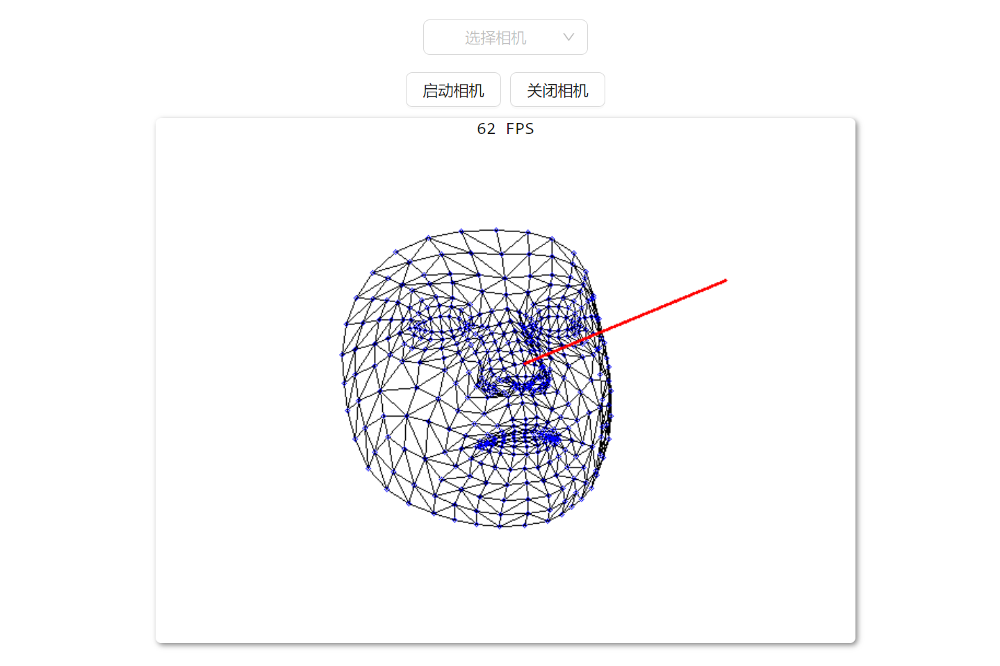

# simple-react-face-fandmark-detection

## Description

Welcome to Simple React Face Landmark Detection, a delightful open-source project that combines the power of TensorFlow.js and OpenCV.js to detect facial landmarks and render them on images. Say goodbye to complexity and hello to simplicity with this user-friendly tool.

## Introduction:
Simple React Face Landmark Detection is a cutting-edge project designed for developers seeking an easy-to-use solution for facial landmark detection. Leveraging the capabilities of TensorFlow.js and OpenCV.js, this project offers a seamless integration for detecting key facial features in images.

## Features
1. **Effortless Integration**: With its simple React-based architecture, incorporating face landmark detection into your projects has never been easier.
2. **Accurate Detection**: Utilizing the robustness of TensorFlow.js, this project ensures precise detection of facial landmarks, providing reliable results.
3. **Real-time Rendering**: Witness the magic as OpenCV.js dynamically renders detected facial landmarks onto images, offering a real-time visualization of key facial features.
4. **Customizable**: Adapt the project to your needs with ease. Modify settings, tweak parameters, and tailor the detection process according to your requirements.
5. **Lightweight**: Despite its powerful functionalities, this project maintains a lightweight footprint, ensuring efficient performance across various platforms and devices.

## How to Use:
1. **Installation**: Simply clone the repository and install dependencies using `npm i -g yarn && yarn`.
2. **Running**: Running project using `npm start`
3. 
## Contribution
We welcome contributions from developers of all skill levels. Whether you're fixing bugs, adding new features, or enhancing documentation, your contributions are valuable to the growth of this project. Feel free to fork the repository, make your changes, and submit a pull request.

## Closing Notes
The development process of the project is documented in the author's blog on CSDN. Below is the blog link, hoping it will be helpful to you.

1. [如何在前端项目中使用 OpenCV.js | Getting Started with OpenCV.js](https://blog.csdn.net/qq_41456316/article/details/137447999)
2. [如何使用 TensorFlow.js 实现面部特征点检测 | Facial Landmark Detection with TensorFlow.js](https://blog.csdn.net/qq_41456316/article/details/137155470)
3. [TensorFlow.js 如何从 public 路径加载人脸特征点检测模型 | Loading Facial Landmark Detection Model from Public Path in TensorFlow.js](https://blog.csdn.net/qq_41456316/article/details/137382659)
4. [TensorFlow.js 如何使用 OpenCV.js 通过面部特征点估算脸部姿态并绘制示意图 | Estimating Facial Pose and Drawing Diagrams with TensorFlow.js and OpenCV.js](https://blog.csdn.net/qq_41456316/article/details/137501430)
5. [tensorflow.js 使用 opencv.js 将人脸特征点网格绘制与姿态估计线绘制结合起来，以获得更高的帧数 | 
Combining Facial Landmark Grid Drawing and Pose Estimation Line Drawing using TensorFlow.js and OpenCV.js for Higher Frame Rates](https://blog.csdn.net/qq_41456316/article/details/137565175)